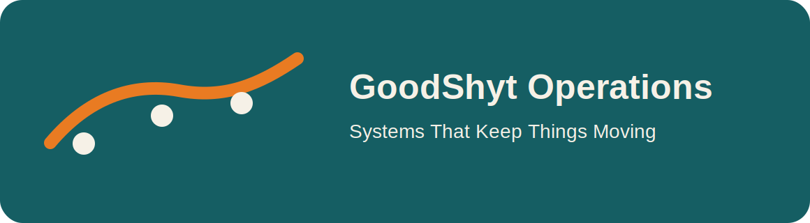

# GoodShyt Operations



Operational orchestration for service environments, workflow coordination, and intelligent community-facing systems.

## Brand line
**Systems That Keep Things Moving**

## Features
- workflow planning
- staffing-aware task filtering
- blocked task detection
- execution summaries
- FastAPI service for runtime orchestration

## Quickstart
```bash
pip install -e .[dev]
uvicorn goodshyt_operations.api:app --reload
```

## Visual assets
- `assets/logos/primary.svg`
- `assets/logos/mark-dark.svg`
- `assets/covers/repo-cover.svg`

**Architected by Deonte Watts**  
**GoodShyt Group**  
*Ethical Infrastructure for Human and Community Flourishing*
